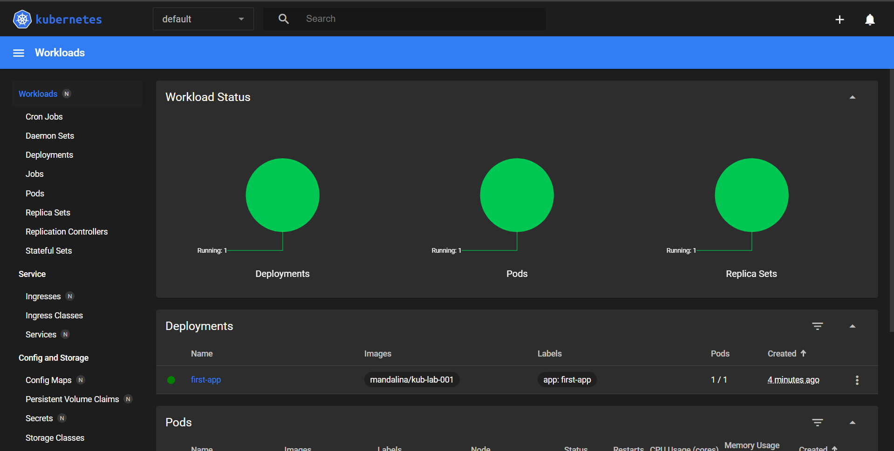

### Kubernetes Lab 001

First we builded our app: 

    docker build -t kub-first-app . 

Checking our minikube app with:

    minikube status

If our minikube is not started, we simply type:

    minikube start

After ensuring our minikube is running, we can create a deployment object with the image we just created but here is the thing, we cant give our local image to the cluster, therefor we need to upload our image to docker hub and then give to cluster:

Send image to docker hub:

    docker tag kub-first-app mandalina/kub-lab-001

    docker push mandalina/kub-lab-001

Now our image in our remote repository, now we can proceed:

    kubectl create deployment first-app --image=kub-mandalina/kub-lab-001

If we want to see our deployments, we can use:

    kubectl get deployments

If we want to see our pods, we can use:

    kubectl get pods

# 

If we want to see our pods and deployments inside our cluster, we can use minikube's dashboard like this:

    minikube dashboard

And if we click on the given ip, we can see information about our cluster:

Using "Service" object:

    kubectl  expose deployment first-app --type=LoadBalancer --port=8080

And then we can see our services with:

    kubectl get services

Since we are using minikube for our demo lab, we have to use this code in order to check if our pods is working how we want it:

    minikube service first-app

If we want to scale our images(instances), we can use this command:

    kubectl scale deployment/first-app --replicas=3

This code right here will create 3 replicas for our first-app deployment. It will create the same number of containers if there more than 1 container inside the pod.

To update deployments, we have to use tags in our new created build:

    docker build -t kub-first-app:2 .

    docker tag kub-first-app mandalina/kub-lab-001:2

    docker push mandalina/kub-lab-001:2

    kubectl set image deployment/first-app kub-lab-001=mandalina/kub-lab-001:2

# 

If we want to check the status of our deployment:

    kubectl rollout status deployment/first-app

If we want to undo our latest deployment:

    kuebctl rollout undo deployment/first-app 

If we want to rollout to a specific version, we can use this for history:

    kubectl rollout history deplotment/first-app 

and then:

    kuebctl rollout history deployment/first-app --revision=[id]

After finding our desired version:

    kubectl rollout undo deployment/first-app --to-revision=[revision_target_id]

#

Another way to create deployments is .yaml files. After creating .yaml file, we can simply use this:

    kubectl apply -f .\deployment.yaml

Then we can create our service.yaml file too and run this service like this:

    kubectl apply -f .\service.yaml 
    minikube service [your_service_name]

With this commands, your service will be up and running.

Annnddd after creating this deployments, you can use this to delete multiple deployments:

    kubectl delete -f .\deployment.yaml

We can actullay merge .yaml files with only using `---` between the objects, it makes sense. 

Also one of the main things that we can write into our Deployment Configuration File is `livenessProbe`.
This feature tells kubernetes to look to container if the container is healthy or not. 
This is one of the most important things for checking if the services is working or not because this feature can use 
httpGet and stuff. 
